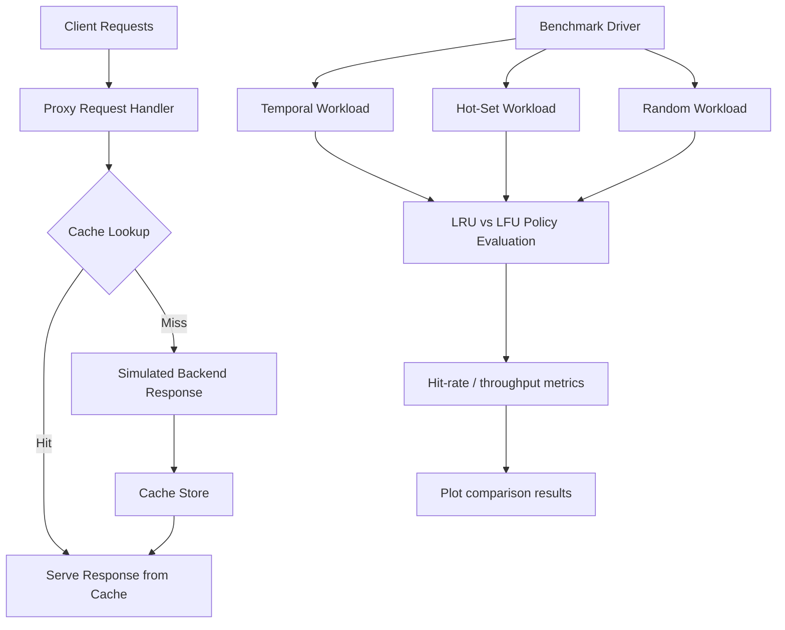

# High-Performance HTTP Proxy with Adaptive Caching

A systems-focused project designed to demonstrate cache design, concurrency, and performance engineering in a polished, interview-ready format.

## Project Description

This project builds a lightweight but realistic HTTP proxy and caching system to study how request serving, eviction policies, and workload characteristics affect latency, throughput, and hit rate. It combines classic systems ideas with modern benchmarking and evaluation workflows, creating a project that feels credible for performance, systems, and infrastructure roles.

The implementation includes:

- multithreaded request handling
- LRU and LFU eviction strategies
- adaptive cache policy selection based on workload behavior
- synthetic load generation and benchmarking
- hit-rate and latency analysis
- performance visualization for policy comparison

## Architecture



## Why this project stands out

This project is especially strong for resume use because it demonstrates:

- systems design and low-level performance reasoning
- concurrency and thread-safe engineering
- cache policy tradeoff analysis
- benchmarking and empirical validation
- data-driven decision making under different workload conditions

It combines the spirit of a 15-213-style systems assignment with a cleaner and more portfolio-ready framing, making it suitable for candidates applying to big companies in systems, cloud, or performance engineering.

## Repository structure

```text
PerformanceProxy/
├── README.md
├── requirements.txt
├── pyproject.toml
├── .gitignore
├── src/
│   └── performance_proxy/
│       ├── __init__.py
│       ├── cache.py
│       ├── proxy.py
│       ├── benchmark.py
│       ├── load_test.py
│       └── metrics.py
├── tests/
│   ├── test_cache.py
│   ├── test_proxy.py
│   ├── test_metrics.py
│   └── test_benchmark.py
├── scripts/
│   └── benchmark.sh
├── results/
│   └── cache_policy_comparison.png
└── .venv/
```

## Quick start

```bash
python3 -m venv .venv
source .venv/bin/activate
python -m pip install --upgrade pip
python -m pip install -r requirements.txt
python -m pip install -e .
pytest -q
```

## Run the benchmark suite

```bash
python -m performance_proxy.benchmark
```

This generates a comparison between LRU and LFU policies under different synthetic workloads and writes a plot to the `results/` directory.

## Run synthetic load testing

```bash
python -m performance_proxy.load_test
```
